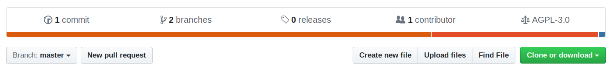
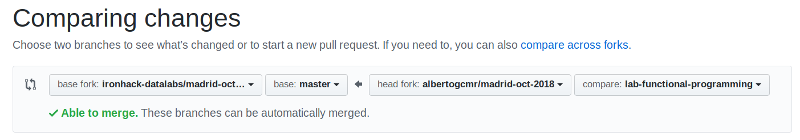

## Git -> Github

Para cada ejercicio o proyecto nuevos seguiremos los mismos pasos: 

1. Cambiar a la rama master. 
2. Crear una nueva rama desde master con el nombre adecuado. 
3. Crear el contenido que queramos. 
4. Añadir el conenido nuevo al siguiente commit. 
5. Guardar el nuevo commit. 
6. Subir el nuevo commit a github

```
(old-branch) $ git checkout master
(master) $ git checkout -b new-branch
(new-branch) $ code file.py
(new-branch) $ git status
(new-branch) $ git add file.py
(new-branch) $ git commit -m "initial commit"
(new-branch) $ git push origin new-branch
```

## Pull request

Ahora que ya está todo el contenido de tu rama new-branch en tu github, se puede crear una pull request. 

1. Dentro del repositio adecuado pulsar el botón de new pull request. 



2. Seleccionar repositorios y ramas. 



3. Poner el título adecuado a la pull request para que sea fácilmente localizable, debería ser similar a: 

* **[lab-functional-programming] [datamad0819] Nombre Apellido**

## Upstream

En caso de que se añada nuevo contenido al repositorio que habéis hecho Fork y Clone, como cuando se incluyen ejercicios adicionales, hay que añadir un nuevo remoto. 

1. Copiamos la URL del repositorio original desde el botón Clone or Download. 


2. Añadirmos la nueva fuente de datos a nuestro git. 

```
(master) $ git remote add upstream URL
(master) $ git pull upstream master
```