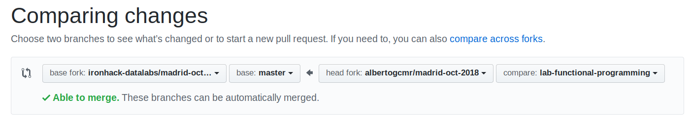

# Git & Github

## 1. Daily work Ironhack

### New Lab

Para cada ejercicio o proyecto nuevos seguiremos los mismos pasos: 

1. Cambiar a la rama master. 
2. Crear una nueva rama desde master con el nombre adecuado. 
3. Crear el contenido que queramos. 
4. Añadir el conenido nuevo al siguiente commit. 
5. Guardar el nuevo commit. 
6. Subir el nuevo commit a github

```shell
(old-branch) $ git checkout master
(master) $ git checkout -b new-branch
(new-branch) $ code file.py
(new-branch) $ git status
(new-branch) $ git add file.py
(new-branch) $ git commit -m "initial commit"
(new-branch) $ git push origin new-branch
```

### Pull request

Ahora que ya está todo el contenido de tu rama new-branch en tu github, se puede crear una pull request. 

1. Dentro del repositio adecuado pulsar el botón de new pull request. 


2. Seleccionar repositorios y ramas. 



3. Poner el título adecuado a la pull request para que sea fácilmente localizable, debería ser similar a: 

* **[lab-functional-programming] [datamad0819] Nombre Apellido**

### Upstream

En caso de que se añada nuevo contenido al repositorio que habéis hecho Fork y Clone, como cuando se incluyen ejercicios adicionales, hay que añadir un nuevo remoto. 

1. Copiamos la URL del repositorio original desde el botón Clone or Download. 


2. Añadirmos la nueva fuente de datos a nuestro git. 

```shell
(master) $ git remote add upstream URL
(master) $ git pull upstream master
```

## 2. Initialize a Git local repository


```shell
$ mkdir git-practice # Create new directory called git-practice
$ cd git-practice # Making the new directory the working one
$ git init # Turns the new working directory into a Git repository. A folder called .git is created with all the info
$ echo "Hello Git" >> README.md # Create a new file
$ git add README.md # Adds the new file to the Git staging area
$ git commit -m "first commit" # Commit version permanently
```

To display the state of the working directory and stagins area. It shows: 
* Changes not staged
* Staged changes
* Files not tracket by Git

```
$ git status
```

## 3. Initialize a repository on gitHub and link it to a local

1. Create a new repository on gitHub wit a README.md
2. Set up in HTTPS
3. Push an existing repository from the command line
    * origin: remote alias name you are going to create. It is good practice to call it `origin`
    * URL: provided by GitHub

```shell
$ git remote add origin URL
$ git push -u origin master
```
4. GitHub's repository should now include the files in the local repository

HINT: You can add multiple remotes to the local repository as shown in `Upstream` section above. 

## 4. Clone GitHub repository in local repository and pushing chantes to GitHub

```shell
$ git clone URL # Clones GitHub repository locally. p.e: git-to-clone
$ cd git-to-clone
$ git add .
$ git commit -m "adding clone to repository"
$ git push # Push to GitHub repository (if not staged origin is the GitHub from which it was cloned)
$ git log # show commit log
q # exit list of commit
```

## 5. Git Branches

```shell
$ git branch # checks branch I am currently on and rest
$ git branch -a # to display all branches including those i have not created or worked locally
$ git branch new-branch # creates a new branch called `new-branch`
$ git checkout new-branch # switch to branch
```

To remove a branch

```shell
$ git branch -d old-branch
```

To create and switch to a new branch: 

```shell
$ git checkout -b new-branch
```

### Commit changes

```shell
$ git add filename # Adds filename
$ git add . # Adds any new or modified file
$ git commit -m "commit message"
```

To add and commit all changes that you have made (deletions and updates) but not new added files. 

```shell
$ git commit -am "commit message"
```

### Merge branches

```shell
$ git merge old-branch
```

**Merge conflicts**: When trying to merge two branches, when both have had commit after treating the branch. 
    * Go to conflicted flie in receiver branch and manually solve the conflict. 
    * add and commit. 

## 6. Git Workflow

_TO DO_


## 7. Terms

* **Pull Request**: request for other collaborators to review the code before mergin (add comments and aprove or reject pull request)

* **Fork**: Personal copy of someone else's repository. We can either keep the fork (head) to ourselves or create a pull request back to the original repository (base)

To remove a remote: 
```shell
$ git remote remove personal-remote
```

To get help (manual): 
```shell
$ git help
$ git -h
$ git commit -h
```